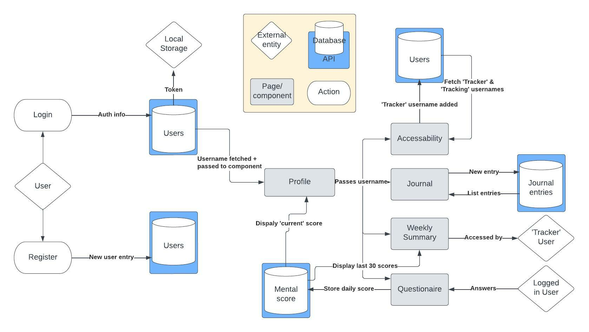
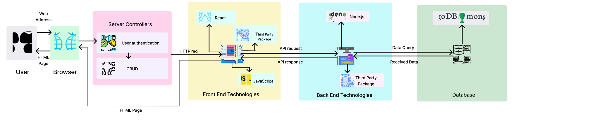

# SERENE - Documentation 

## Site Description

### Purpose 

Multiple research has shown that documenting emotions has positive effects on one's mental-wellbeing, as it allows them to reflect on current events in their life and gain a better understanding of their emotions. 

Serene is a mental health journaling platform that gives users – and other users they authorise – the ability to log and track changes in their emotional state through time.

Serene was built to solve the problem people face in (1) recounting discrete changes in their mental health and (2) disclosing these changes to the people around them.

It does this by allowing users to log their mental state each day via journal entries and a weekly wellbeing questionnaire, with select data summarised by a weekly/daily graphical snapshot. 

Unfortunately, many people struggle to disclose their mental state to others. With Serene, users can grant access to their mental wellbeing data to other users (e.g. psychologists, social workers, family members) for the purposes of monitoring.

This app will help users better understand their moods so that they can manage them and feel better faster. Also, it’s easier to make decisions related to health which can provide a better quality of life.

Serene aims to help people manage low moods and navigate triggering situations. The app also plays a role in reducing the stigma in  communities where mental illness isn’t widely talked about. A recent study showed approximately 20% of Australians were reportedly living with a mental disorder in 2021 (ABS,2022), which illustrates the need for easily accessible mental health resources. 

### Functionality/features 

- A homepage includes a hero component and a Sign-in/Sign-up button for direct user auth access
- Ability for users to add short journal entries with accompanying ‘emotion’ tags
- A simple mental wellbeing questionnaire – optionally answered weekly 
- Ability for users to view a daily, weekly and monthly summary of their mental wellbeing, as recorded with journal entry tags and questionnaire results. 
- Ability for users to grant access to their weekly summary to select users

### Target Audience 

Although all demographics are welcomed to user Serene, it is initially targeted at therapists/social workers by providing a way to remotely track the mental health of the people under their duty of care. 
  
## Tech Stack 

### <u>Front end</u>

React, Bootstrap

### <u>Back end</u>

Express/Node js, MongoDb, Mongoose 

### <u>Testing</u>

Vitest, Jest

### <u>Deployment</u>

Railway 

## Data Flow Diagram

## Application Architecture Diagram

## User stories 

Home 
- User must be able to register and sign in to their profile 
- User should be given a summary of what the app does 

Profile 
- User should have constant access to navigation via a navbar
- User should be able to see their username, welcome message and inspirational quote

Journal [profile component child]
- User should be able to post a journal entry with text, an ‘emotion’ tag and timestamp at any time
- User should be able to see a list of previous journal entries
- User should be able to delete posts

Weekly summary [profile component child]
- User should be able to see a summary of the past 30 days, that for each day shows (1) date (2) questionnaire score/colour (3) tags posted 

Questionnaire [profile component child]
- Each week a user should have the opportunity to answer a mental wellbeing questionnaire that gives them a score out of 10-50  
- User should have this score stored with a timestamp in the db
- User should be blocked for completing the questionnaire more than one time per week

Grant Access [profile component child]
- User should be able to see a list of usernames that have given them access to view their calendar (trackers) 
- Users should be able to search and add usernames to a list of people who can view THEIR summary (populate ‘tracking’ field in db collection)

Settings 
- User must be able to delete their account

## Wireframes 

High-resolution wireframes located in /assets/Wireframes.

### <u>Sign up</u>

### <u>Log in</u>

### <u>Profile</u>

### <u>Journal</u>

### <u>Questionnaire</u>

### <u>Summary</u>
 

### <u>Settings</u>

### <u>Authorise remote tracker</u>

## Trello Screenshots 
(https://trello.com/b/MMurIsLO/mern-frontend-kanban)  

## References 

ABS. 2022. National Study of Mental Health and Wellbeing. https://www.abs.gov.au/statistics/health/mental-health/national-study-mental-health-and-wellbeing/latest-release. Accessed 20/1/2023